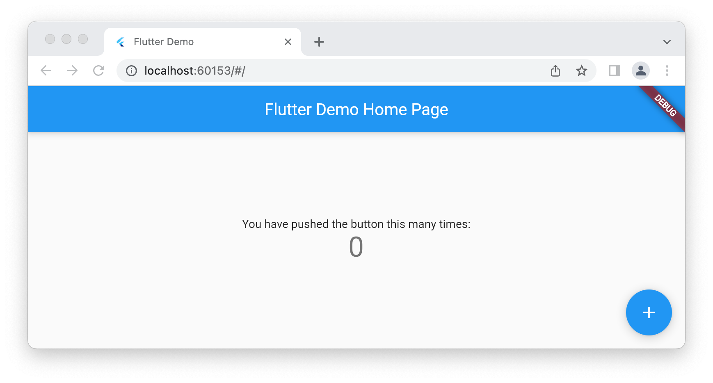

# flutter-web-app

GitHub repo template to skaffold amazing web apps and app-like static websites with Flutter on Web.

## Development setup

Install [Flutter](https://flutter.dev) on your platform like described in the Flutter documentation:

- [Linux](https://docs.flutter.dev/get-started/install/linux)
- [macOS](https://docs.flutter.dev/get-started/install/macos)
- [Windows](https://docs.flutter.dev/get-started/install/windows)

Alternativelly installation is possible on

- Linux and macOS using the [brew](https://brew.sh) package manager with `brew install --cask flutter`.
- Windows using the [scoop](https://scoop.sh/) package manager with `scoop bucket add extras; scoop install flutter`.

Install [Chrome](https://www.google.com/intl/us_en/chrome/) on your platform via [Download](https://www.google.com/google_chrome/download).

Alternativelly installation is possible with package managers

- Linux and macOS with `brew install --cask google-chrome`
- Windows `scoop bucket add extras; scoop install googlechrome`

Check the setup. The output of `flutter doctor` should contain something indicating that Flutter is installed properly and that Chrome is available:

```
...
[✓] Flutter (Channel stable, 3.3.4, on macOS 12.6 21G115 darwin-x64, locale de-DE)
...
[✓] Chrome - develop for the web
...
[✓] VS Code (version 1.72.0)
[✓] Connected device (2 available)
[✓] HTTP Host Availability
```

Run the website with `flutter run -d chrome`, should open a tab in Chrome.



## Deployment

This template does support deployment via [GitHub pages](https://pages.github.com).

The deployment uses the ["Creating a custom GitHub Actions workflow to publish your site" workflow](https://docs.github.com/en/pages/getting-started-with-github-pages/configuring-a-publishing-source-for-your-github-pages-site#creating-a-custom-github-actions-workflow-to-publish-your-site).
This includes usage of [`actions/upload-pages-artifact`](https://github.com/actions/upload-pages-artifact) and [`actions/deploy-pages`](https://github.com/actions/deploy-pages).
For more information refer to [`actions/starter-workflows` (pages)](https://github.com/actions/starter-workflows/tree/main/pages) and [`actions/deploy-pages` issue "Error : Invalid actions OIDC token due to sub_invalid #9"](https://github.com/actions/deploy-pages/issues/9)

If you use this template to generate a web app

- for your **personal GitHub account** you need to configure `http(s)://<username>.github.io`,
- for your **personal GitHub repository** you need to configure 
`http(s)://<username>.github.io/<your-repo-name>` or
- for an **GitHub organization repository** you need to configure `http(s)://<orgname>.github.io/<your-repo-name>`.
